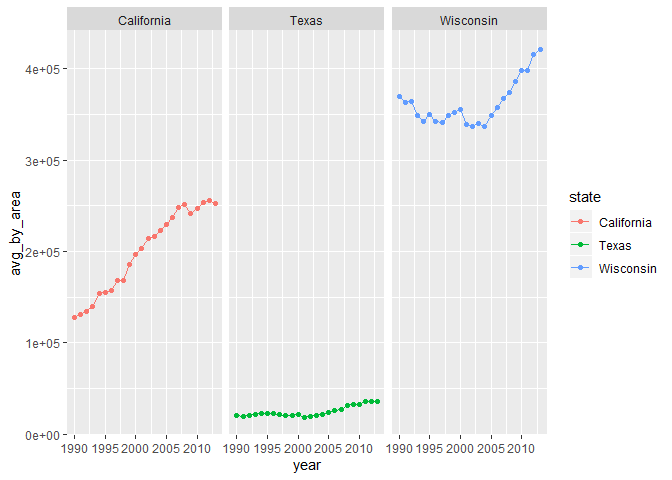

    library(tidyverse)

    ## -- Attaching packages --------------------------------- tidyverse 1.3.0 --

    ## v ggplot2 3.2.1     v purrr   0.3.3
    ## v tibble  2.1.3     v dplyr   0.8.3
    ## v tidyr   1.0.0     v stringr 1.4.0
    ## v readr   1.3.1     v forcats 0.4.0

    ## -- Conflicts ------------------------------------ tidyverse_conflicts() --
    ## x dplyr::filter() masks stats::filter()
    ## x dplyr::lag()    masks stats::lag()

### A hard warm up

    milk = read_csv("https://github.com/rfordatascience/tidytuesday/raw/master/data/2019/2019-01-29/milkcow_facts.csv")

    ## Parsed with column specification:
    ## cols(
    ##   year = col_double(),
    ##   avg_milk_cow_number = col_double(),
    ##   milk_per_cow = col_double(),
    ##   milk_production_lbs = col_double(),
    ##   avg_price_milk = col_double(),
    ##   dairy_ration = col_double(),
    ##   milk_feed_price_ratio = col_double(),
    ##   milk_cow_cost_per_animal = col_double(),
    ##   milk_volume_to_buy_cow_in_lbs = col_double(),
    ##   alfalfa_hay_price = col_double(),
    ##   slaughter_cow_price = col_double()
    ## )

    head(milk)

    ## # A tibble: 6 x 11
    ##    year avg_milk_cow_nu~ milk_per_cow milk_production~ avg_price_milk
    ##   <dbl>            <dbl>        <dbl>            <dbl>          <dbl>
    ## 1  1980         10799000        11891     128406000000          0.13 
    ## 2  1981         10898000        12183     132770000000          0.138
    ## 3  1982         11011000        12306     135505000000          0.136
    ## 4  1983         11059000        12622     139588000000          0.136
    ## 5  1984         10793000        12541     135351000000          0.135
    ## 6  1985         10981000        13024     143012000000          0.127
    ## # ... with 6 more variables: dairy_ration <dbl>, milk_feed_price_ratio <dbl>,
    ## #   milk_cow_cost_per_animal <dbl>, milk_volume_to_buy_cow_in_lbs <dbl>,
    ## #   alfalfa_hay_price <dbl>, slaughter_cow_price <dbl>

    milk %>% 
      pivot_longer(c("avg_milk_cow_number",
                     "milk_per_cow",
                     "milk_production_lbs",
                     "avg_price_milk",
                     "dairy_ration",
                     "milk_feed_price_ratio",
                     "milk_cow_cost_per_animal",
                     "milk_volume_to_buy_cow_in_lbs",
                     "alfalfa_hay_price",
                     "slaughter_cow_price"),
                   names_to = "variable",
                   values_to = "value") %>% 
      ggplot(aes(x = year, y = value)) +
      geom_point() +
      geom_line() +
      facet_wrap(~variable, scales = "free")

    # easier way
    milk %>% 
      pivot_longer(-year,
                   names_to = "variable",
                   values_to = "value") %>% 
      ggplot(aes(x = year, y = value, col = variable)) +
      geom_point() +
      geom_line() +
      facet_wrap(~variable, scales = "free")

### Show that wisconsin is best.

    milkprod = read_csv("https://github.com/rfordatascience/tidytuesday/raw/master/data/2019/2019-01-29/state_milk_production.csv")

    ## Parsed with column specification:
    ## cols(
    ##   region = col_character(),
    ##   state = col_character(),
    ##   year = col_double(),
    ##   milk_produced = col_double()
    ## )

    head(milkprod)

    ## # A tibble: 6 x 4
    ##   region    state          year milk_produced
    ##   <chr>     <chr>         <dbl>         <dbl>
    ## 1 Northeast Maine          1970     619000000
    ## 2 Northeast New Hampshire  1970     356000000
    ## 3 Northeast Vermont        1970    1970000000
    ## 4 Northeast Massachusetts  1970     658000000
    ## 5 Northeast Rhode Island   1970      75000000
    ## 6 Northeast Connecticut    1970     661000000

    # average milk production
    milkprod %>% 
      group_by(state, year) %>% 
      summarise(avg_milk_produced = mean(milk_produced, na.rm = T)) %>% 
      ggplot(aes(x = year, y = avg_milk_produced, col = state)) +
      geom_point() +
      geom_line() +
      facet_wrap(~state)

    milkprod %>% 
      ggplot(aes(x = year, y = milk_produced, col = state))+
      geom_point() +
      geom_line() +
      facet_wrap(~state)

???seems take average automatically.

    milkprod %>% 
      ggplot(aes(x = year, y = milk_produced, col = state))+
      geom_point() +
      geom_line() +
      facet_wrap(~state, scales = "free")

    milkprod %>% 
      group_by(state) %>% 
      summarise(total_prod = sum(milk_produced)) %>% 
      ggplot(aes(x = 1, y = total_prod, col = state))+
      geom_point()+
      facet_wrap(~state)

    milkprod %>% 
      filter(state == "Texas"| state =="California"| state =="Wisconsin") %>% 
      ggplot(aes(x = year, y = milk_produced, col = state))+
      geom_point() +
      geom_line() +
      facet_wrap(~state)

    popu = read_csv("https://raw.githubusercontent.com/jakevdp/PythonDataScienceHandbook/master/notebooks/data/state-population.csv")

    ## Parsed with column specification:
    ## cols(
    ##   `state/region` = col_character(),
    ##   ages = col_character(),
    ##   year = col_double(),
    ##   population = col_double()
    ## )

    area = read_csv("https://raw.githubusercontent.com/jakevdp/PythonDataScienceHandbook/master/notebooks/data/state-areas.csv")

    ## Parsed with column specification:
    ## cols(
    ##   state = col_character(),
    ##   `area (sq. mi)` = col_double()
    ## )

    states = read_csv("https://raw.githubusercontent.com/jakevdp/PythonDataScienceHandbook/master/notebooks/data/state-abbrevs.csv")

    ## Parsed with column specification:
    ## cols(
    ##   state = col_character(),
    ##   abbreviation = col_character()
    ## )

    data = popu %>% 
      pivot_wider(names_from = ages, values_from = population) %>% 
      mutate(state = states$state[match(`state/region`, states$abbreviation)]) %>% 
      select(state,year,under18,total) %>% 
      left_join(area, by = "state") %>% 
      left_join(milkprod, by = c("state","year")) %>% 
      mutate(avg_by_tot_popu = milk_produced/total,
             avg_by_under_18 = milk_produced/under18,
             avg_by_area = milk_produced/`area (sq. mi)`) %>% 
      filter(state == "Wisconsin"|state == "Texas"|state == "California") 

    data %>% ggplot(aes(x = year, y = avg_by_area, col = state))+
      geom_point() +
      geom_line() +
      facet_wrap(~state)

    data %>% ggplot(aes(x = year, y = avg_by_under_18, col = state))+
      geom_point() +
      geom_line() +
      facet_wrap(~state)

    data %>% ggplot(aes(x = year, y = avg_by_tot_popu, col = state))+
      geom_point() +
      geom_line() +
      facet_wrap(~state)

    data %>% ggplot(aes(x = year, y = avg_by_area, col = state))+
      geom_point() +
      geom_line() +
      facet_wrap(~state, scales = "free")

    data %>% ggplot(aes(x = year, y = avg_by_under_18, col = state))+
      geom_point() +
      geom_line() +
      facet_wrap(~state, scales = "free")

    data %>% ggplot(aes(x = year, y = avg_by_tot_popu, col = state))+
      geom_point() +
      geom_line() +
      facet_wrap(~state, scales = "free")

Better not use ‘scales = “free”’ cuz we are comparing among plots.
